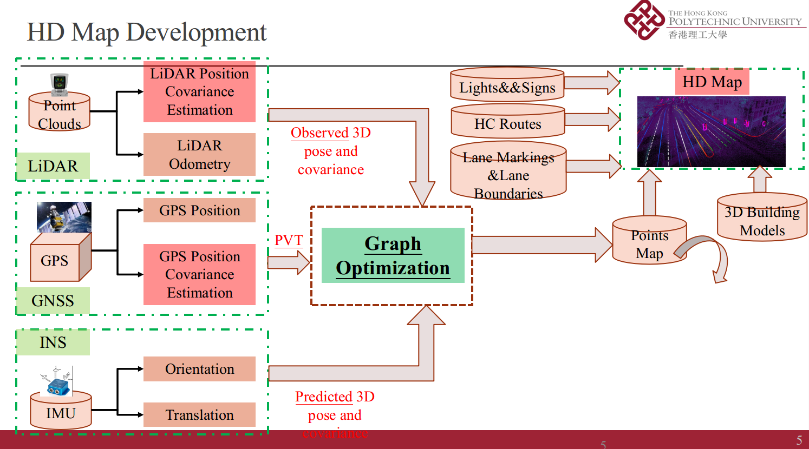
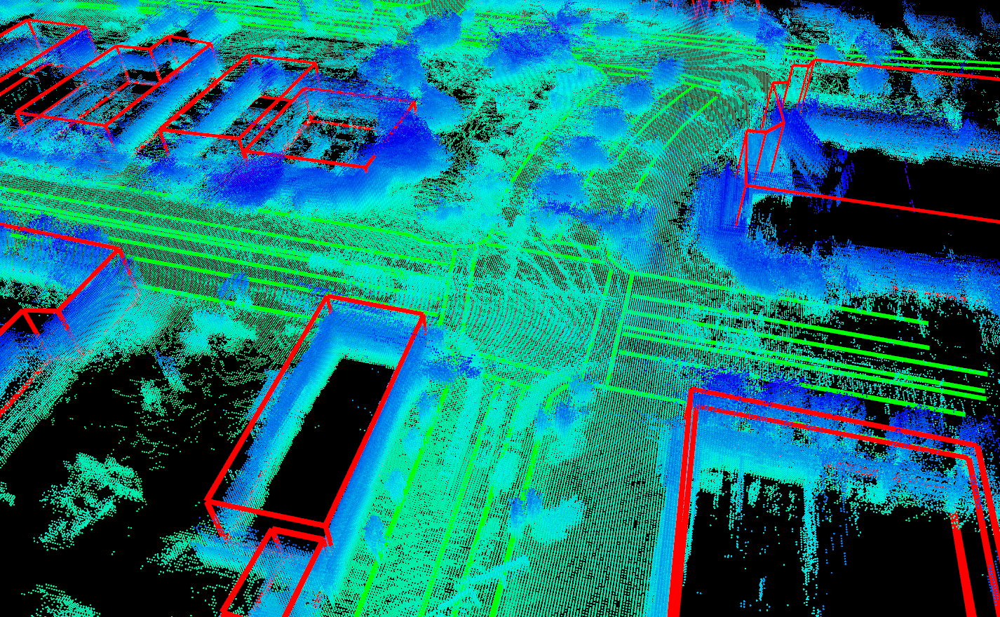
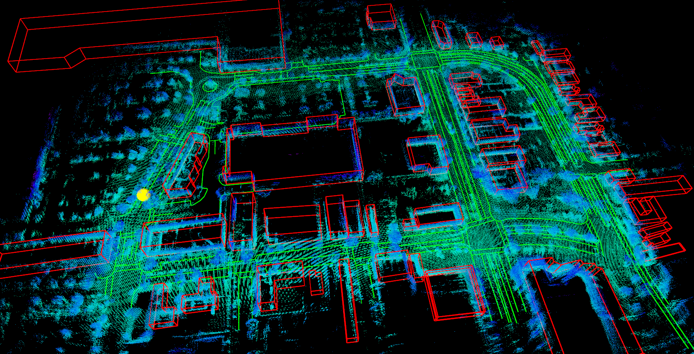

### High definition map development for Autonomous vehicles

The main task for mapping is to generate proper prior representation of environments. Generally, the HD Map should contain the following parts

- 1st layer: points map
- 2nd layer: lane markings and road boundaries
- 3rd layer: Lights and traffic signs
- 4th layer: 3D building models
- 5th layer: high confidence routes

MapLocalization is an open source ROS package for high definition map generation for autonomous driving. It firstly generate the points map using sensor information from LiDAR, INS (optional) and GNSS. Then the other road information is also added into the high definition map. In this package, points map is generated using LiDAR and GNSS (ENU) based on graph optimization. The example map is generated in El cerrito, Berkeley, California, USA. The next step is to generate. 






## Spec Recommendation

- Number of CPU cores: 4
- RAM size: 16GB or larger
- Storage size: 30GB in SSD

## Requirements

- ROS jade (Ubuntu 14.04)
- Qt 5.2.1 or higher

### Install dependencies for Ubuntu 14.04 jade

install all the dependency when needed


## How to Build

```
$ cd $HOME
$ mkdir AMSI/src
$ cd AMSI/src
$ git clone ...
$ catkin_init_workspace
$ cd ..
$ catkin_make
```

## How to Start
### points map generation

```
roslaunch hdl_graph_slam hdl_graph_slam_400.launch

```

The subscribed topics are /points_raw and /nmea_sentence. please be noted: To transform the LiDAR coordinate system into ENU. please modify the "68.5 " value in the file hdl_graph_slam_nodelet.cpp at line 278

```
double theta = (68.5 )*( 3.141592 / 180.0 ); 

```

### Load 3D building models

The 3D building models are saved in kml file, then parsed into ENU with given reference point.

```
roslaunch amsi loadBuildingModels.launch

```

### Load road boundaries and lane markings

The 3D building models are saved in kml file, then parsed into ENU with given reference point.

```
roslaunch amsi loadLandMarkingsAndBoundaries.launch

```


## How to use this for your data

The data is saved in Dropbox. The data for public will be opened soon,


## Research Papers for Reference

1. 
2. under update

## Claim

As some of the code refers to some existing repositories, including [Autoware](https://github.com/CPFL/Autoware) and [hdl_graph_slam](https://github.com/koide3/hdl_graph_slam). If there is any thing inappropriate, please contact me through 17902061r@connect.polyu.hk (Weisong WEN). This work is finished in Unicersity of California, Berkeley. Thanks for the help of Dr. Wang and Dr. Zhan.


## LICENSE
### BSD License – PolyU

Copyright (c) 2018 [Weisong WEN](https://github.com/weisongwen)

All rights reserved.

Redistribution and use in source and binary forms, with or without modification, are permitted provided that the following conditions are met:

* Redistributions of source code must retain the above copyright notice, this list of conditions and the following disclaimer.

* Redistributions in binary form must reproduce the above copyright notice, this list of conditions and the following disclaimer in the documentation and/or other materials provided with the distribution.

* Neither the name of the <organization> nor the names of its contributors may be used to endorse or promote products derived from this software without specific prior written permission.

THIS SOFTWARE IS PROVIDED BY THE COPYRIGHT HOLDERS AND CONTRIBUTORS "AS IS" AND ANY EXPRESS OR IMPLIED WARRANTIES, INCLUDING, BUT NOT LIMITED TO, THE IMPLIED WARRANTIES OF MERCHANTABILITY AND FITNESS FOR A PARTICULAR PURPOSE ARE DISCLAIMED. IN NO EVENT SHALL THE COPYRIGHT OWNER OR CONTRIBUTORS BE LIABLE FOR ANY DIRECT, INDIRECT, INCIDENTAL,SPECIAL, EXEMPLARY, OR CONSEQUENTIAL DAMAGES (INCLUDING, BUT NOT LIMITED TO, PROCUREMENT OF SUBSTITUTE GOODS OR SERVICES;LOSS OF USE, DATA, OR PROFITS; OR BUSINESS INTERRUPTION) HOWEVER CAUSED AND ON ANY THEORY OF LIABILITY, WHETHER IN CONTRACT, STRICT LIABILITY, OR TORT (INCLUDING NEGLIGENCE OR OTHERWISE) ARISING IN ANY WAY OUT OF THE USE OF THIS SOFTWARE,EVEN IF ADVISED OF THE POSSIBILITY OF SUCH DAMAGE.
